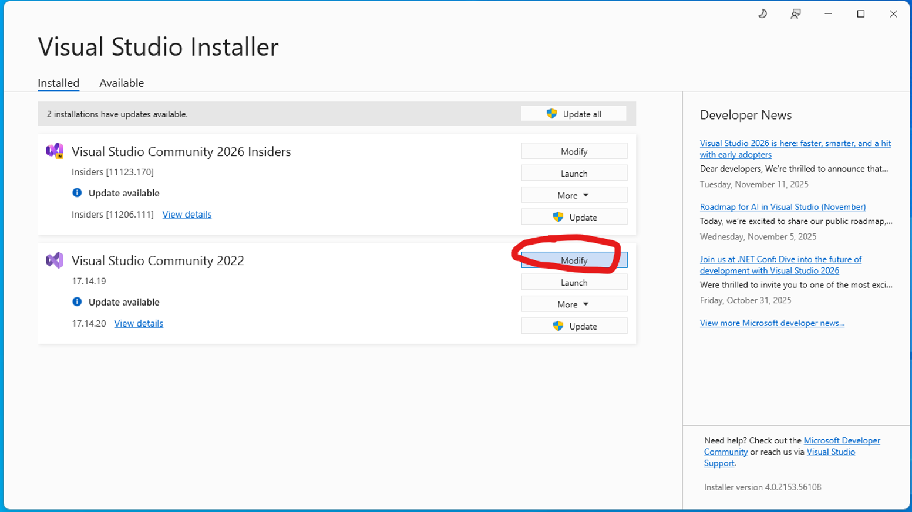
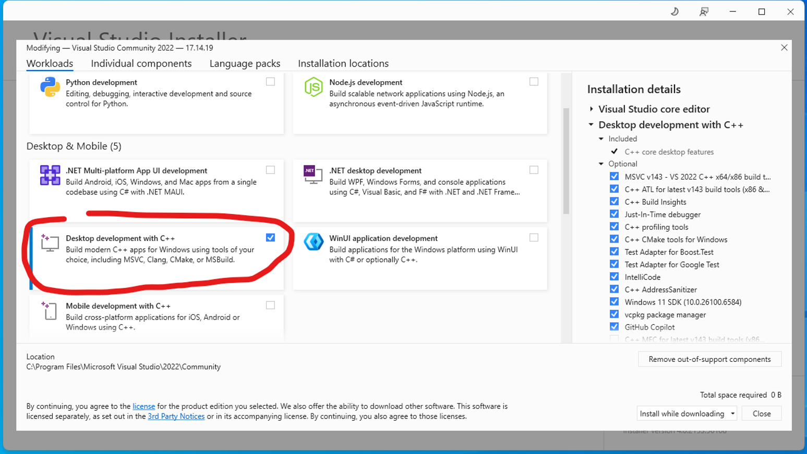
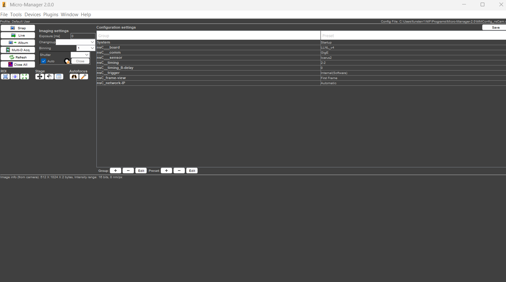
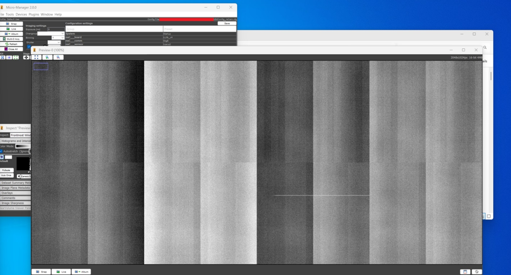
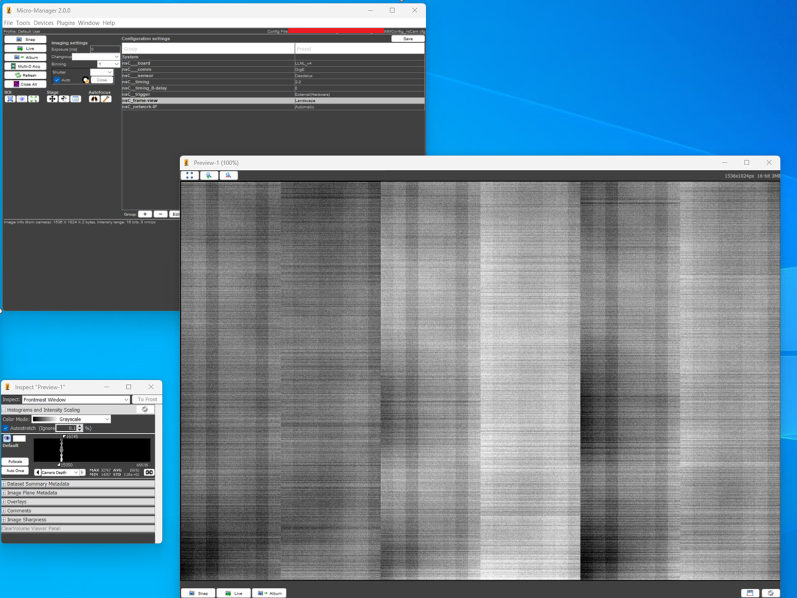

**Readme for ImageJ Micro-Manager Plugin Interfacing with hCMOS Camera**

Updated: 12/1/2025

Authors: Jeremy Hill, Brad Funsten, Peter Nyholm

## Installing & Getting Started 

Before beginning, it is assumed the user has:

1.  Anaconda Python 3.X installed

2.  Windows 11 Operating System

### Installing Microsoft Visual Studio followed by the C++ development package to be able to run Micro-Manager:

1.  Download and install Visual Studio if it is not already installed.
    Specifically, download the Community (free) version from the link:
    <https://visualstudio.microsoft.com/downloads/>.

2.  Run the program, Visual Studio Installer. Select 'Modify' for the
    Visual Studio Community program.

 

3.  In the 'Workloads' tab, select and install 'Desktop development with
    C++'.

 

4.  Download the 64-bit Micro-Manager 2.0.0 July 13^th^, 2021 build
    from <https://micro-manager.org/Download_Micro-Manager_Latest_Release>.

5.  Run the Micro-Manager installer. The operating system might detect
    the download is potentially dangerous -- select the appropriate
    options to continue installing. We recommend installation in a user
    directory (one that does not require administrator access to
    modify).

6.  Delete ImageJ.exe from the resulting Micro-Manager directory.

### Copy python39 environment into Micro-Manager:

7.  Download or clone this repository (python39 environment folder).

8.  Unzip the Windows_nsPlugin1.0.2.zip folder in the cloned repository
    location.

9.  Copy all contents of the Windows_nsPlugin1.0.2 folder into the base
    Micro-Manager directory.

## Run plugin:

10. Double-click *\_Start_ImageJ.vbs* to start the application. If you
    wish the application to run with console output,
    double-click *\_Start_ImageJ(terminal).bat*.

11. Replace Start menu shortcut (Optional, may require administrator
    permissions):

<!-- -->

A.  Select startup scripts that you wish to add to the start menu
    (*\_Start_ImageJ.vbs*, *\_Start_ImageJ(terminal).bat*, or both),
    right-click, and select \'Create shortcut\'. A. Find the
    Micro-Manager shortcut in the Start menu. Right click and select
    \'More/Open file location\'. A. Delete the existing Micro-Manager
    shortcut from the opened directory. Copy the newly created shortcuts
    over to this directory. A. Rename the shortcuts to remove the \'-
    Shortcut\' suffix.

## Plugin Operation:

1.  In the startup configuration window, select the nsCamera config
    file *MMConfig_nsCam.cfg* (which you just copied into the
    Micro-Manager directory) and click OK.

    - Upon startup, the Micro-Manager plugin does not automatically
      establish a connection with the camera hardware. This is intended
      to permit the user to make changes to critical connection
      configuration options (e.g., IP address) that may be required to
      successfully connect with the camera.

2.  Choose your operating parameters using the drop-down options in the
    \'Configuration settings\' section on the right-hand side of the
    MicroManager panel. Be sure in particular to confirm that you have
    correct board, comm, sensor, and IP settings before attempting an
    acquisition. If the desired parameter is not available from the
    prepopulated options (e.g., you want different timing settings for
    sides A and B), they can be set directly using the Device Property
    Browser available from the Tools menu.

 

- If a connection with the camera hardware does not exist, one will be
  established if a property is changed that requires active interaction
  with the board (e.g., a pot/DAC value) or if an image snap is
  requested. (This may require several seconds.)

- If a connection to the board already exists, and any of the
  fundamental CameraAssembler parameters (board, sensor, comm, IP
  address, or port number) or manual/automatic connection parameters are
  changed, nothing will happen immediately, but a new connection with
  the camera will be established just before acquisition (that is, after
  a snap is requested). Every new connection will require several
  seconds to set up.

- The \'ShowFrame\' option selects what image will be acquired:

  - First/Last frame: displays only the first or last frame of the
    acquisition sequence.

  - Average: displays a per-pixel averaged image over all frames
    acquired.

  - Landscape: displays all frames acquired side-by-side in single
    image.

- Other options are described in greater detail in the nsCamera
  documentation.

3.  Acquisition is triggered by clicking the \'Snap\' button. If a
    connection with the board has not already been established, it will
    take several seconds for the board to initialize before an image is
    acquired.

4.  Repeated acquisitions may be started by clicking the \'Live\'
    button. Images will be acquired as quickly as the board and software
    can process images.

Landscape output example of an Icarus camera:

 

Landscape output example of a Daedalus camera:

 

## Issues:

1.  'RS422' preset under nsC_comm does not work. If you select 'snap'
    after selecting RS422, then the program will close.

2.  Cannot run 'daedalus' preset under nsC_sensor when interfacing with
    a camera programmed for Icarus firmware.
